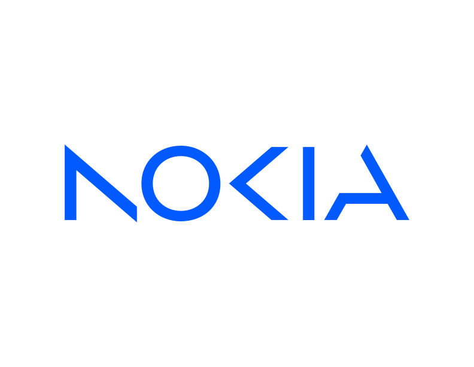

<div align="center">
  
</div>

<div align="center">

[](https://github.com/nokia/corteca-cli/actions/workflows/build.yml)
[](https://github.com/nokia/corteca-cli/actions/workflows/test.yml)
[](https://codecov.io/gh/nokia/corteca-cli)

</div>

# Corteca Developer Toolkit

Corteca Developer Toolkit is a command-line tool for building, packaging, and
deploying container applications to Nokia broadband devices. It covers the full
application lifecycle — from scaffolding a new project to publishing the build
artifact and running deployment sequences on a live device.

## Features

- **Project scaffolding** — bootstrap a new application project from a
  language template (C, C++, Go) with `corteca create`.

- **Cross-architecture builds** — build and package the application inside an
  isolated Docker container with QEMU-based cross-compilation support, targeting
  `aarch64`, `armv7l`, or `x86_64` and producing OCI, Docker, or rootfs output.

- **Flexible publishing** — deliver the build artifact via a local HTTP(S)
  server, HTTP PUT upload, OCI registry push, or a locally hosted Docker
  Distribution registry.

- **Device deployment** — run named sequences of deployment steps on a remote
  device over SSH or CWMP (TR-069).

- **Configuration management** — inspect and modify any setting through the
  `corteca config` command; most fields support template expressions that are
  evaluated at runtime against the current command context.

- **Template-driven file generation** — keep generated project files (such as
  `Dockerfile`) in sync with application settings using `corteca regen`.

## What is a Corteca application?

A Corteca application is a container image (OCI or Docker format) designed to
run on the managed execution environment of a Nokia broadband device. Each
application has a unique identifier (DUID), a target architecture, and a
self-contained runtime that is isolated from the host firmware. Applications
are described by a `corteca.yaml` manifest that captures everything needed to
build, publish, and deploy them: source dependencies, build options, publish
targets, and deployment sequences.

Corteca supports three target architectures out of the box — `aarch64`,
`armv7l`, and `x86_64` — and can produce OCI images, Docker images, or Nokia
rootfs archives depending on the target device.

## What is a Corteca device?

A Corteca device is any Nokia broadband device that Corteca can connect to in
order to deploy and manage applications. Two connectivity protocols are
supported:

- **SSH** — for devices that expose a shell, such as development boards or
  devices running [prplOS](https://prplos.eu). Corteca opens an SSH session
  and runs a user-defined sequence of shell commands on the device.
- **CWMP (TR-069 / TR-369)** — for carrier-grade CPE managed via the
  [TR-069](https://www.broadband-forum.org/technical/download/TR-069.pdf)
  protocol. Corteca acts as an ACS: it starts a local HTTP(S) listener, sends
  a connection request to the CPE, and drives the session by issuing RPCs such
  as `ChangeDUState` (install/remove a Deployment Unit) and
  `SetParameterValues` (configure or start an Execution Unit).

Devices and the sequences to run on them are configured in `corteca.yaml` and
can be targeted by name when running `corteca exec`.

<hr>

## Prerequisites

| Requirement | Version  | Notes                                          |
| ----------- | -------- | ---------------------------------------------- |
| Go          | ≥ 1.21   | Required to build from source                  |
| Docker      | ≥ 23.0   | Required to build application container images |
| Docker BuildKit | ≥ 0.11 | Required for `docker build --output`         |
| make        | any      | Used to drive the build and install targets    |

## Build

Clone the repository and run:

```bash
make
```

The compiled binary is placed in the `dist/` directory.

### Build using Docker

If you do not have a local Go toolchain, you can build entirely inside Docker
(BuildKit is required):

```bash
docker build --output ./dist .
```

#### Installing Docker BuildKit

On Docker Engine < 23.0, BuildKit must be enabled manually. On Ubuntu 22.04:

```bash
sudo apt-get install docker-buildx-plugin
```

Then either prefix each `docker build` invocation with `DOCKER_BUILDKIT=1`, or
follow the [official instructions](https://docs.docker.com/build/buildkit/#getting-started)
to enable it globally.

> For the full build guide see [doc/BUILD.md](doc/BUILD.md).

## Install

Install the binary to `$GOBIN` (defaults to `$HOME/go/bin`) and the required
template files to `$HOME/.config/corteca`:

```bash
make install
```

To remove a previous installation:

```bash
make uninstall
```

> For the full build guide see [doc/BUILD.md](doc/BUILD.md).

## Getting Started

The fastest way to get up and running is to create a project, build it, and
publish it to a local registry in three commands:

```bash
corteca create my-app          # scaffold a new application project
cd my-app
corteca build aarch64          # build an OCI image for aarch64
corteca publish localRegistry  # push it to a local OCI registry
```

For a step-by-step walkthrough — including how to configure a device target and
run a deployment sequence — see **[doc/GettingStarted.md](doc/GettingStarted.md)**.

## Configuration

All Corteca settings live in `corteca.yaml`. Configuration is read
cascadingly from three locations:

| Precedence | Location                            | Scope            |
| ---------- | ----------------------------------- | ---------------- |
| Lowest     | `/etc/corteca/corteca.yaml`         | System-wide      |
|            | `$HOME/.config/corteca/corteca.yaml`| User global      |
| Highest    | `./corteca.yaml` (project root)     | Per-project      |

The project-level file is found by walking up from the current working
directory, so `corteca` commands work from any subdirectory of a project.

The `corteca config` command can be used to inspect or modify any value
without editing YAML by hand:

```bash
corteca config get publish          # show all publish targets
corteca config set app.version 1.1  # update a value
```

For a full reference of every configuration key, their types, defaults, and
supported template expressions, see **[doc/Configuration.md](doc/Configuration.md)**.

## Command Line Reference

| Command | Description |
| ------- | ----------- |
| [`corteca create`](doc/reference/corteca_create.md) | Scaffold a new application project from a template |
| [`corteca build`](doc/reference/corteca_build.md) | Build and package the application for a target architecture |
| [`corteca publish`](doc/reference/corteca_publish.md) | Upload or serve the build artifact via a configured publish target |
| [`corteca exec`](doc/reference/corteca_exec.md) | Run a named deployment sequence on a configured device |
| [`corteca config`](doc/reference/corteca_config.md) | Inspect or modify configuration values |
| [`corteca config get`](doc/reference/corteca_config_get.md) | Read a configuration value |
| [`corteca config set`](doc/reference/corteca_config_set.md) | Write a configuration value |
| [`corteca config add`](doc/reference/corteca_config_add.md) | Append to a list or map configuration value |
| [`corteca regen`](doc/reference/corteca_regen.md) | Regenerate template-derived project files |

For a broader overview of all commands, flags, and usage patterns see
**[doc/USAGE.md](doc/USAGE.md)**.

Every command also accepts `--help` for inline usage information:

```bash
corteca --help
corteca build --help
```
