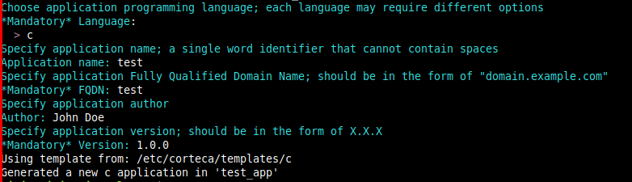
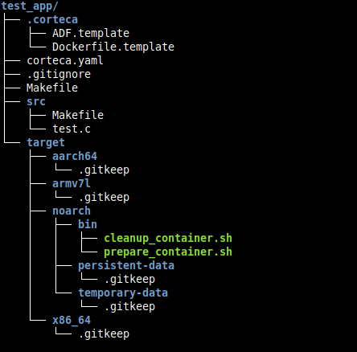
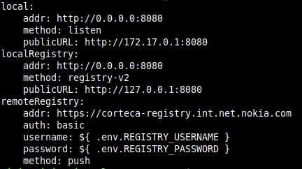

# Getting Started

## Install corteca cli
Follow the instructions in [BUILD](BUILD.md) guide

## Create, build and publish an OCI application from scratch

### Create Application

Corteca cli can create projects for applications written in C, C++ or Go. In the following example a C project is created, but any other choice will work for a pre-built rootfs image.

Change to the directory where you want your application directory to be created and run the following command:

`corteca create test_app`

Follow the prompt instructions to specify the details of the application.

Note that if a mandatory option is not properly set up, the create procedure will fail.

A folder named after the given parameter (test_app) in the above command will be created with all the generated files inside.

The current configuration of the application is in corteca.yaml

For more info on corteca create check [corteca create](reference/corteca_create.md) guide.

### Build application
To build an application, corteca cli uses docker container where all the needed dependencies and tools are installed. The dockerfile will be auto generated on build using the *Dockerfile.template* found under *.corteca* folder.
Corteca supports by default builds for aarch64, armv7l, x86_64 architectures and output types for OCI, docker and nokia custom images.

For this example we will build an OCI image build for armv7l architecture.

Enter the folder created on the previous step.

`cd test_app`
`corteca build -c 'build.options.outputType=oci' armv7l`

When the build process is finished, the generated artifact will be placed in *dist/* folder. For this example a *test-1.0-armv7l-oci.tar* will be generated.

For more info on corteca build check [corteca build](reference/corteca_build.md) guide.

### Publish your application
Corteca cli provides a publish functionality to help users upload their produced artifacts in an OCI registry. There are some registries set up by default in corteca that can be used as a template from the user to set up the target registry. You can check the current configuration for publish using

`corteca config get publish`

#### Publish in corteca local registry
User can use the already set up local registry.

`corteca publish localRegistry armv7l`

Corteca will set up a local oci registry and will upload the artifact. (check with https://localhost:8080/v2/_catalog). If this registry is needed to be visible outside the host device, publicURL needs to be changed to the device IP.

`corteca config set publish.localRegistry.publicURL http://192.168.18.2:8080`

#### Publish in custom registry
User can add his own registry using *corteca config*

`corteca config add publish "{myregistry: { addr: https://my-registry.com, auth: basic, username: user1, password: pass1, method: push}}"`

Notice that a new section was added in corteca.yaml with all the registry info.

After the registry is set up, the application can be uploaded.

`corteca publish myregistry armv7l`

For more info on corteca publish check [corteca publish](reference/corteca_publish.md) guide.

## Configuring application
Application configuration is noted in the corteca.yaml file placed in application's folder when created. The *app* section -related to the create command- specifies app settings you can alter during the build process. 
The complete set of settings for Corteca Cli is created by combining this file with /etc/corteca/corteca.yaml.
Corteca cli provides methods to show or edit these settings using the *config* method. You can also check or edit the settings values using the auto complete of Corteca cli by pressing <TAB> key twice like in a shell.

`corteca config get app`

To check a specific value

`corteca config get app.version`

To set a value

`corteca config set app.version 1.0.1`

For more detailed guide on config get/set/add please refer to [corteca config](reference/corteca_config.md)  guide.
